### Desenvolvedor de software com visão de negócio e experiência em gestão

## Perfil

Bacharel em Sistemas de Informação, com experiência em gestão operacional, análise de processos, levantamento de requisitos e regras de negócio. Desenvolvo projetos de software a partir de necessidades reais e aprofundo minha prática em JavaScript e React, com o objetivo de evoluir para full stack.

## Tecnologias

Tecnologias utilizadas nos projetos, sem representar domínio de toda a stack.

## Projeto principal

<table>
  <tr>
    <td width="58%">
      
    </td>
    <td width="42%" valign="top">
      <h3>DeliveryFone Trade OS</h3>
      
Aplicação web criada a partir de necessidades reais da operação de uma loja de telefonia.

      
<strong>Status:</strong> Versão de portfólio em evolução, com ambiente privado de teste.

      
<strong>Funcionalidades e recursos:</strong>

      <ul>
        <li>estoque e fluxo de vendas;</li>
        <li>perfis de gestor e vendedor;</li>
        <li>políticas RLS por filial e cargo definidas nos scripts SQL;</li>
        <li>avaliação de aparelhos usados;</li>
        <li>relatórios comerciais;</li>
        <li>testes automatizados com Jest.</li>
      </ul>
      <a href="https://github.com/jjoaomarcelo-dev/deliveryfone-trade-os"><strong>Explorar o projeto →</strong></a>
    </td>
  </tr>
</table>

### Capíva Installment Tracker

Aplicação para cadastrar e acompanhar compras parceladas, com cálculo de vencimentos, controle de pagamentos, consulta mensal e armazenamento dos dados no navegador.

**Tecnologias:** JavaScript, HTML5, CSS3 e LocalStorage.

[Explorar o projeto de compras parceladas →](https://github.com/jjoaomarcelo-dev/capiva-installment-tracker)

## Experiência aplicada ao desenvolvimento

- Gestão operacional e administrativa, liderança de equipe e análise de processos como base para compreender necessidades do negócio.
- Atendimento e contato com usuários para avaliar a experiência de uso.
- Formação em Sistemas de Informação como base para transformar processos em software.

## Prática atual

- **Desenvolvimento de Software:** exercícios de programação e construção de interfaces com JavaScript e React.
- **Análise de Sistemas:** tradução de necessidades em requisitos, fluxos e regras de negócio.

## Como trabalho

No DeliveryFone Trade OS, defini os requisitos, os fluxos e as regras de negócio a partir da minha experiência na operação e validei funcionalidades com usuários. A implementação contou com apoio de ferramentas de IA. Atualmente, aprofundo os fundamentos de programação e reviso o projeto para ampliar minha autonomia na manutenção do código.

---

`problema real` → `regra de negócio` → `desenvolvimento de software`

